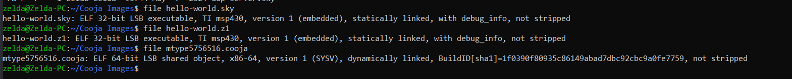

# 1\. Binary Kimlik Analizi

- Hedef platform analizi (`.z1` / `.sky` / `ARM M4F(CC1352R)` / `cooja-native`)
- MSP430 mimari tipi
- ELF format bilgisi
- Endianness nedir ve Endianness bilgisi
- Entry point adresi
- ABI nedir ve ABI bilgisi
- Compiler izi
- Toolchain versiyonu
- Optimization level tahmini
- Debug symbol var/yok analizi

 

Sky ve z1 32 bitlik statik linkli ve msp430 üzerinde çalışacak bir elf dosyası iken cooja 64 bitlik, dinamik linkli ve 32 ve 64 bitlik işlemcilerde çalışıcaktır.. Tüm platformlar little endianness kullanıyor yani veri LSB (least signifanct bit) göre sıralanır.

**Entry point address;** İşlemcinin resetten hemen sonra kodu çalıştırmaya başladığı bellek adresidir.  Aşağıdaki tabloda görüldüğü gibi üç dosyanında başlangıç adresi farklıdır.

| Sky | 0x4000 |
| --- | --- |
| Z1  | 0x3100 |
| Cooja | 0x14b00 |

**ABI (Application Binary Interface) Bilgisi;**  
ABI, derlenmiş bir programın donanım veya işletim sistemi ile nasıl iletişim kuracağını belirleyen standarttır. Sky ve Z1\*\*,\*\* OS/ABI alanı "Standalone App" olarak görünmektedir. Bu, firmware'in bir işletim sistemi üzerinde değil donanım üzerinde çalışacağını gösterir.

|     |     |     |
| --- | --- | --- |
| Dosya | ABI Tipi | Anlamı |
| Sky / Z1 | Standalone App | Donanıma bağımlı, OS içermeyen uygulama. |
| Cooja | UNIX - System V | Linux/POSIX standartlarına uygun simülasyon objesi. |

**Debug Symbol;** Dosyanın içinde fonksiyon isimleri ve değişken adlarının bulunup bulunmamasıdır. Z1 (20 sections), Sky (19 sections), Cooja (31 sections) içerir. Section header sayılarının bu denli yüksek olması, dosyaların sembollerin temizlenmemiş olduğunu gösterir. Dosya içinde .debug_info, .debug_line ve .symtab gibi bölümler mevcuttur. Bu durum, firmware'in GDB gibi araçlarla hata ayıklamasına uygun olduğunu ve tersine mühendislik aşamasında fonksiyon isimlerinin okunabileceğini ifade eder. Eğer dosya "stripped" olsaydı, section sayısı çok daha düşük olurdu.

ELF formatı, SoC üzerindeki loader kodun hangi parçasını flash belleğe, hangi parçasını RAM'e yazacağını anlamasını sağlar. Ham binary'de bu meta-veriler bulunmaz.

&nbsp;

# 2\. Bellek Kullanım Analizi

- Flash, RAM, Stack, Heap anlamları
- Flash kullanım miktarı
- RAM kullanım miktarı
- `.text` boyutu
- `.data` boyutu
- `.bss` boyutu
- Stack kullanım tahmini
- Heap var/yok analizi
- Section dağılımı
- Memory map analizi
- Büyük veri yapılarının tespiti

 

&nbsp;

Bellek Türlerinin İşlevleri; Flash alanı, programın makine kodlarını ve değiştirilemez sabit verilerini sakladığı kalıcı depolama birimidir. Enerji kesildiğinde veriler burada korunur. RAM alanı, programın icrası sırasında değişken verilerin işlendiği ve hızlı erişim sağlanan geçici çalışma belleğidir. Stack bölgesi, fonksiyon çağrıları sırasında yerel değişkenlerin ve geri dönüş adreslerinin geçici olarak tutulduğu, bellek sonundan aşağıya doğru büyüyen kısımdır. Heap ise çalışma anında dinamik olarak talep edilen bellek blokları için ayrılan alandır.

Bölüm Boyutları ve Teknik Anlamları; .text bölümü, programın yürüttüğü asıl komut dizilerini içerir ve fiziksel olarak sadece Flash bellekte yer kaplar.  
.data bölümü, başlangıç değeri atanmış global ve statik değişkenleri barındırır. Bu bölümün verileri başlangıçta Flash bellekte saklanır ancak program çalışmaya başladığında RAM üzerine kopyalanır.  
.bss bölümü, başlangıç değeri verilmemiş veya sıfır olarak işaretlenmiş değişkenleri temsil eder. Bu bölüm dosyada yer kaplamaz, sadece çalışma anında RAM üzerinde ne kadar yer ayrılacağı bilgisini taşır.

Fiziksel Alan Kullanım Miktarları; Flash kullanım miktarı, msp430-size çıktısındaki text ve data bölümlerinin toplamı ile hesaplanır. Bu toplam, cihazın kalıcı belleğinin ne kadarının dolduğunu gösterir.  
RAM kullanım miktarı, data ve bss bölümlerinin toplamı ile elde edilir. Bu değer, cihazın çalışma anında ihtiyaç duyduğu minimum statik bellek kapasitesini ifade eder.

Stack ve Heap Analizi; Stack kullanım tahmini için sembol tablosundaki stack başlangıç sembolü ile belleğin en üst adresi arasındaki fark incelenir. Eğer sembol tablosunda malloc veya free gibi dinamik bellek yönetimi fonksiyonları görülmüyorsa, bu firmware içerisinde Heap bölgesinin kullanılmadığı sonucuna varılır. Gömülü sistemlerde bellek kısıtı nedeniyle genellikle sadece statik bellek ve stack kullanımı tercih edilir.

Section Dağılımı ve Memory Map Analizi; Dosyadaki bölümlerin dağılımı msp430-readelf -S komutu ile incelendiğinde, düşük adreslerde kesme vektörlerinin, ardından program kodlarının yer aldığı görülür. CC1352R teknik dokümanındaki bellek haritası ile karşılaştırıldığında, Flash bölümlerinin başlangıç adreslerinden itibaren sıralı şekilde yerleştiği ve RAM bölümlerinin ise sistemin SRAM başlangıç adresine hizalandığı doğrulanır.

Büyük Veri Yapılarının Tespiti; sembol tablosu msp430-nm -S komutu ile boyutlarına göre sıralandığında, bellek üzerinde en çok yer kaplayan veri yapıları tespit edilir. Genellikle büyük boyutlu diziler, ağ paket tamponları veya sensör verisi depolama alanları bss veya data bölümlerinde en geniş yeri işgal eden yapılar olarak öne çıkar. Bu yapıların boyutu, cihazın RAM kapasitesini zorlayıp zorlamadığına dair kritik bilgi sunar.

* * *

# 3\. Symbol / Function Analizi

- Fonksiyon isimleri
- Global değişkenler
- Static değişkenler
- ISR (interrupt) fonksiyonları
- Contiki process entry’leri
- Radio driver fonksiyonları
- Timer callback’leri
- Networking callback’leri
- Sensor handler’ları
- Kullanılan kütüphaneler
- Kullanılmayan (dead) fonksiyonlar
- Function address mapping

 

Sembol tablosu, firmware içerisindeki tüm fonksiyonların, değişkenlerin ve sürücülerin bellek üzerindeki yerleşim haritasıdır. Fonksiyon isimleri, yürütülebilir kodun bulunduğu bölgede yer alır ve işlemcinin hangi işlemleri gerçekleştirebileceğini tanımlar. Global değişkenler, programın her noktasından erişilebilen ve yaşam döngüsü uygulama boyunca süren verilerdir. Static değişkenler ise sadece tanımlandığı modül içerisinde görünür olan kalıcı veri yapılarını temsil eder.

Donanım seviyesindeki etkileşimleri yöneten ISR fonksiyonları, kesme sinyali geldiğinde işlemcinin öncelikli olarak çalıştırdığı özel alt programlardır. Contiki işletim sistemi mimarisine sahip imajlarda süreç girişleri, işletim sisteminin görev zamanlayıcısı tarafından yönetilen ana döngüleri ifade eder. Radio driver fonksiyonları, kablosuz iletişim donanımının düşük seviyeli kontrolünü sağlayan komut setleridir. Timer callback yapıları, zamanlayıcı donanımı belirli bir değere ulaştığında otomatik olarak tetiklenen geri dönüş mekanizmalarıdır. Networking callback yapıları ise ağ protokol yığını üzerinden veri iletimi veya alımı gerçekleştiğinde devreye giren işleyicileri tanımlar. Sensör işleyicileri, çevre birimlerinden gelen ham verilerin işlenmesini ve anlamlandırılmasını sağlar.

Sistem içerisinde kullanılan kütüphaneler, standart matematiksel işlemlerden ağ haberleşme protokollerine kadar hazır kod bloklarının projeye dahil edilmiş halidir. Kullanılmayan ölü fonksiyonlar, sembol tablosunda yer almasına rağmen program akışında hiçbir zaman çağrılmayan ve bellek alanını gereksiz işgal edebilen kod bölümleridir. Fonksiyon adres eşlemesi, her bir fonksiyonun bellekteki başlangıç ve bitiş noktalarını belirleyerek sistemin çalışma anındaki tam bir izleğini oluşturur.

* * *

# 4\. String ve Metadata Analizi

- Debug mesajları
- printf logları
- IPv6 adresleri
- MAC adresleri
- Network node ID’leri
- Sensor isimleri
- Process isimleri
- Routing protokol isimleri
- TSCH/6LoWPAN/RPL stringleri
- Hidden diagnostic message’lar
- Hardcoded config değerleri
- Developer notları

Araçlar:

Firmware içerisinde yer alan karakter dizileri, sistemin çalışma mantığını, desteklediği protokolleri ve kullanıcı etkileşim noktalarını anlamayı sağlayan en somut verilerdir. Hata ayıklama mesajları ve yazdırma günlükleri, yazılımın icrası sırasında hangi fonksiyonların tetiklendiğini ve olası hataların hangi bloklarda oluştuğunu takip etmek amacıyla koda yerleştirilmiş ifadelerdir. Bu metinler sayesinde sistemin iç işleyişi hakkında detaylı bir yol haritası elde edilir.

Ağ katmanına dair ipuçları sunan internet protokolü versiyon altı adresleri ve ortam erişim kontrolü adresleri, cihazın kablosuz haberleşme ağlarındaki fiziksel ve mantıksal kimliğini tanımlar. Ağ düğüm kimlikleri ise bir örgü ağ içerisindeki her bir cihazın adreslenmesini sağlar. Sensör isimleri ve süreç tanımlayıcıları, firmware’in hangi donanım bileşenleri ile etkileşim kurduğunu ve arka planda hangi görevleri yürüttüğünü açıkça ortaya koyar.

Haberleşme protokollerine dair tespit edilen yönlendirme protokolü isimleri, zaman dilimli kanallı atlama veya düşük güç tüketimli kablosuz kişisel alan ağları gibi ifadeler, sistemin ağ yığınının teknik mimarisini belgeler. Gizli tanı mesajları, cihazın üretim sonrası test aşamalarında kullanılan ve normal kullanıcıdan saklanan geri bildirim ifadeleridir. Donanım içerisine sabitlenmiş yapılandırma değerleri; sistemin çalışma frekansı, veri iletim hızları veya zaman aşımı süreleri gibi değişmez parametreleri içerir. Geliştirici notları ve kod içerisindeki sürümlendirme bilgileri ise yazılımın gelişim süreci ve tasarım tercihleri hakkında tarihsel veriler sunar.

# 5\. Assembly / Instruction Analizi

- Instruction sequence analizi
- Function prologue/epilogue
- Register kullanımı
- Stack frame yapısı
- ISR akışı
- Loop yapıları
- Branch analizi
- Jump table analizi
- Function call graph
- Inline function tespiti
- Compiler optimization davranışı
- Delay loop analizi
- Busy-wait yapıları
- Context switching
- Protothread expansion
- Scheduler davranışı

 

Yazılımın düşük seviyeli çalışma mantığı, işlemciye iletilen makine komutlarının diziliminin incelenmesiyle anlaşılır. Fonksiyon giriş ve çıkış işlemleri, her alt programın başlangıcında yer alan yığın hazırlığı ve bitişinde yer alan durum geri yükleme adımlarını ifade eder. Bu adımlar sırasında gerçekleştirilen yazmaç kullanımı, verilerin işlemci içerisindeki hızlı depolama birimlerinde nasıl işlendiğini ve fonksiyonlar arası parametre aktarımının nasıl yapıldığını gösterir. Yığın çerçevesi yapısı, her fonksiyonun kendine ait yerel değişkenleri ve geri dönüş adreslerini bellek üzerinde nasıl organize ettiğini belgeler.

Sistemin gerçek zamanlı tepkilerini yöneten kesme servis rutini akışı, bir dış uyarım geldiğinde mevcut iş akışının nasıl durdurulduğunu ve kesme sonrasında kaldığı yere nasıl döndüğünü açıklar. Program içerisindeki döngü yapıları ve dallanma analizleri, karar verme mekanizmalarının ve tekrarlanan işlemlerin verimliliğini ortaya koyar. Çoklu durum yapıları için kullanılan atlama tablosu analizleri, karmaşık yönlendirme mantığının bellek üzerinde nasıl bir dizin yapısıyla optimize edildiğini gösterir. Fonksiyon çağrı grafiği, programın hiyerarşik yapısını ve modüller arası bağımlılıkları tanımlarken; satır içi fonksiyon tespiti, performans artırmak amacıyla hangi kod bloklarının doğrudan çağrı yapıldığı yere gömüldüğünü belirler.

Derleyici optimizasyon davranışı, yazılan kodun bellek alanından tasarruf etmek veya işlem hızını artırmak amacıyla nasıl dönüştürüldüğünü anlamayı sağlar. Zamanlama amacıyla kullanılan gecikme döngüleri ve meşgul bekleme yapıları, işlemci kaynaklarının zaman tabanlı işlemlerde nasıl tüketildiğini gösterir. Bağlam değiştirme ve zamanlayıcı davranışları, işletim sisteminin farklı görevler arasında nasıl geçiş yaptığını ve işlemciyi nasıl paylaştırdığını tanımlar. Özellikle Contiki işletim sistemi mimarisine özgü olan protothread genişlemesi, düşük bellek tüketen çoklu görev yapısının makine kodu seviyesindeki karşılığını ifade eder.

&nbsp;

* * *

# 6\. Source-Level Mapping Analizi

- Address → source line eşleme
- Function → source file eşleme
- ISR → source mapping
- Crash address çözümleme
- Optimization sonrası source mapping
- Inline edilmiş kodların tespiti

Hata ayıklama sembolleri içeren firmware dosyalarında, bellekteki fiziksel adresler ile orijinal kaynak kod satırları arasında doğrudan bir bağ kurulabilir. Adres ve kaynak satırı eşleme işlemi, işlemcinin o an yürüttüğü makine komutunun C programlama dilindeki hangi dosyada ve hangi satırda yazıldığını tespit etmeyi sağlar. Fonksiyon ve kaynak dosya eşlemesi ise, sembol tablosundaki işlevlerin hangi modüllerden derlendiğini ve projenin dosya yapısını ortaya çıkarır.

Donanım kesmeleri ile ilgili olan kesme servis rutini kaynak eşlemesi, düşük seviyeli bir donanım olayının yazılım katmanındaki tam karşılığını belirler. Sistem çalışma anında bir hata ile karşılaştığında veya çöktüğünde elde edilen çökme adresi çözümleme yöntemi, hatanın oluştuğu tam kod bloğuna ulaşılmasını sağlayarak sorunun kaynağını hızlıca tespit eder. Derleyici optimizasyonu uygulanmış kodlarda kaynak eşlemesi, derleyicinin performans artırmak için kodun yerini değiştirdiği veya bazı satırları birleştirdiği durumlarda dahi takibi mümkün kılar. Satır içi olarak işaretlenen kodların tespiti, fonksiyon çağrısı yerine kodun doğrudan icra akışına yerleştirildiği bölümleri belirleyerek hem performans hem de hata ayıklama süreçlerini aydınlatır.

* * *

# 7\. ELF Yapısı Analizi

- ELF header
- Section header
- Program header
- Symbol table
- Relocation entries
- Debug sections
- DWARF info
- Linker-generated metadata
- Startup section
- Vector table
- Initialization routines

ELF başlığı, dosyanın mimarisi, bayt sıralaması ve giriş adresi gibi temel yapısal parametreleri tanımlayan kimlik bölümüdür. Bölüm başlığı tablosu, dosya içerisindeki kod, veri ve sembol tablosu gibi farklı mantıksal kısımların dosya içi konumlarını ve boyutlarını listeler. Program başlığı ise yükleyici mekanizmalar için dosyanın hangi kısımlarının fiziksel belleğin hangi segmentlerine eşleşeceğini belirten ana haritayı sunar.

Sembol tablosu, program içerisindeki fonksiyonların ve global değişkenlerin isimleri ile bellek adresleri arasındaki bağı kuran merkezi dizindir. Yeniden konumlandırma girdileri, derleme aşamasında tam adresi netleşmeyen sembollerin bağlayıcı tarafından doğru fiziksel adreslere yerleştirilmesini sağlayan yönlendirmeleri içerir. Hata ayıklama bölümleri, kaynak kodun yapısını ve değişken isimlerini barındırırken; DWARF bilgisi bu hata ayıklama verilerini standart bir formatta sunarak karmaşık veri tiplerinin ve kod kapsamlarının çözümlenmesine imkan tanır.

Bağlayıcı tarafından üretilen meta veriler, bellek sınırları ve yığın başlangıç noktaları gibi sistem seviyesindeki parametrelerin doğru şekilde yapılandırılmasını sağlar. Başlangıç bölümü, işlemciye güç verildiği anda yığın işaretçisini ayarlayan ve çalışma zamanı ortamını kuran kritik ilk komutları barındırır. Vektör tablosu, donanımsal kesme sinyalleri oluştuğunda işlemcinin hangi adresteki servis rutinine dallanacağını gösteren sabit bir adres listesidir. İlklendirme rutinleri ise ana fonksiyon icra edilmeden önce global değişkenlerin başlangıç değerlerini Flash üzerinden RAM alanına taşıyan ve donanım birimlerini hazır hale getiren temel yapı taşlarıdır.

&nbsp;

# 8\. Interrupt ve Donanım Analizi

- Interrupt vector table
- GPIO access pattern
- Timer interrupt kullanımı
- UART ISR
- Radio interrupt handler
- ADC access
- Sensor polling
- Low-power mode geçişleri
- Clock configuration
- MSP430 register erişimleri

Kesme vektör tablosu, donanım kaynaklı olaylar gerçekleştiğinde işlemcinin hangi kod bloğuna dallanacağını belirleyen merkezi bir yönlendirme dizinidir. Zamanlayıcı kesme kullanımı, sistemin zaman tabanlı görevleri yürütmesini, gecikmeleri hesaplamasını ve gerçek zamanlı işletim sistemi döngülerini sürdürmesini sağlar. Evrensel asenkron alıcı verici kesme servis rutini, seri veri iletişimi sırasında gelen karakterlerin veri kaybı olmadan yakalanmasını ve işlenmesini koordine eder. Telsiz haberleşme kesme işleyicisi, kablosuz ağ üzerinden bir paket alındığında veya iletim tamamlandığında radyo yığınını bilgilendirerek veri akışını yönetir.

Genel amaçlı giriş çıkış erişim desenleri, fiziksel pinlerin durumunun değiştirilmesi veya bağlı olan buton ve anahtar gibi bileşenlerin okunması için kullanılan lojik işlem dizileridir. Analog dijital dönüştürücü erişimi, fiziksel dünyadan gelen voltaj sinyallerinin yazılım tarafından işlenebilecek sayısal değerlere dönüştürülme sürecini kapsar. Sensör yoklama stratejisi, donanımın hazır olup olmadığını belirli aralıklarla kontrol eden ve kesme mekanizmasına alternatif olan bir veri toplama yöntemidir.

Düşük güç modu geçişleri, sistemin boştaki süresini optimize etmek ve enerji tüketimini azaltmak amacıyla CPU çekirdeğinin veya çevre birimlerinin uyku durumuna alınması işlemlerini tanımlar. Saat yapılandırması, sistemin çalışma hızını, haberleşme baud oranlarını ve güç tüketim oranlarını belirleyen dahili osilatörlerin ayarlanması sürecidir. MSP430 yazmaç erişimleri, doğrudan donanım adreslerine komut göndererek çevre birimlerini kontrol eden ve firmware ile fiziksel donanım arasındaki en temel bağ olan düşük seviyeli işlemleri ifade eder.

- # 9\. Networking Analizi
    
- Unicast kullanım tespiti
    
- Broadcast kullanım tespiti
    
- Multicast tespiti
    
- IPv6 stack kullanımı
    
- RPL routing analizi
    
- TSCH scheduler çağrıları
    
- MAC layer interaction
    
- Packet buffer kullanımı
    
- Neighbor table erişimi
    
- Radio transmission akışı
    
- Retransmission logic
    
- ACK mekanizmaları
    
- CSMA/TSCH farkları
    
- Contiki network API kullanımı
    

Ağ iletişim yapısı, cihazın diğer düğümlerle nasıl veri alışverişinde bulunduğunu ve hangi protokol yığınlarını kullandığını belirler. Tekli gönderim tespiti, belirli bir hedef adrese yönelik veri paketlerinin hazırlanması ve iletilmesi süreçlerini kapsar. Genel gönderim tespiti ise ağdaki tüm cihazlara ulaşmayı hedefleyen yapıları ifade eder. Çoklu gönderim tespiti, belirli bir grup düğüme veri iletimi sağlayan mekanizmaların varlığını gösterir. İnternet protokolü versiyon altı yığını kullanımı, modern ve ölçeklenebilir bir ağ mimarisinin varlığına işaret eder.

Yönlendirme protokolü analizi, düğümler arasındaki verinin en verimli yoldan nasıl aktarılacağını belirleyen algoritmaların izlerini sürer. Zaman dilimli kanallı atlama zamanlayıcı çağrıları, iletişimin belirli zaman aralıklarına bölünerek parazitlerin nasıl engellendiğini açıklar. Ortam erişim kontrol katmanı etkileşimi, üst katmanlardan gelen verinin fiziksel radyo birimine nasıl aktarıldığını tanımlar. Paket tamponu kullanımı, verinin iletim öncesinde veya alım sonrasında bellek üzerinde nasıl geçici olarak saklandığını gösterir. Komşu tablosu erişimi, ağdaki diğer düğümlerin bilgilerinin nerede tutulduğunu ve nasıl güncellendiğini belgeler.

Radyo iletim akışı, bir paketin oluşturulmasından fiziksel sinyale dönüşmesine kadar geçen tüm yazılım adımlarını içerir. Yeniden iletim mantığı, paket kaybı durumunda verinin kaç kez ve hangi aralıklarla tekrar gönderileceğini belirler. Onay mekanizmaları, verinin karşı tarafa ulaşıp ulaşmadığının teyit edilmesini sağlar. Taşıyıcı algılamalı çoklu erişim ve zaman dilimli kanallı atlama farkları, ağın yoğunluk yönetimi ve enerji verimliliği stratejisini ortaya koyar. Contiki ağ uygulama programlama arayüzü kullanımı, geliştiricilerin ağ servislerine erişmek için kullandığı standart fonksiyon setlerini ifade eder.

# 10\. Wireless / TSCH Analizi

- TSCH slot operation
- Channel hopping logic
- ASN handling
- Radio timing loops
- Synchronization routines
- Schedule management
- Packet timing
- MAC timing critical path
- Drift compensation
- Low-power radio behavior

TSCH slot operasyonu, iletişimin sabit zaman dilimlerine bölünerek her dilimde veri iletimi veya alımı gibi belirli bir işlemin gerçekleştirilmesini sağlar. Kanal atlama mantığı, her zaman diliminde farklı bir radyo frekansı kullanarak ortamdaki parazit ve sinyal sönümlenme etkilerini en aza indirir. Mutlak zaman dilimi numarası yönetimi, ağdaki tüm düğümlerin ortak bir zaman referansı üzerinden senkronize olmasını sağlayan ve ağın başlangıcından itibaren artan küresel bir sayaç sistemidir. Radyo zamanlama döngüleri, mikro saniye hassasiyetinde radyonun ne zaman aktif edileceğini ve veri paketinin ne zaman havaya bırakılacağını koordine eden en düşük seviyeli kod bloklarıdır.

Senkronizasyon rutinleri, ağın ana düğümü ile uç düğümler arasındaki saat farklarını sürekli takip ederek ağ bütünlüğünü koruyan mekanizmalardır. Çizelge yönetimi, hangi zaman diliminde hangi kanal ofseti ile hangi komşu düğümle haberleşileceğini belirleyen hücre tahsis süreçlerini kontrol eder. Paket zamanlaması, verinin fiziksel ortamda kapladığı süreyi ve paketler arası boşlukları yönetirken; MAC zamanlaması kritik yolu, işlemin gecikmeksizin tamamlanması gereken en hassas ve öncelikli kod yollarını tanımlar. Kayma telafisi, donanımsal osilatörlerdeki frekans farklarını yazılımsal olarak düzelterek düğümlerin birbirinden zamanla uzaklaşmasını engeller. Düşük güç radyo davranışı, telsiz biriminin sadece aktif zaman dilimlerinde enerji harcamasını sağlayarak pil ömrünü maksimize eden çalışma modlarını ifade eder.

# 11\. Sensor ve Peripheral Analizi

- Button handler
- LED driver
- UART usage
- SPI access
- I2C access
- ADC routines
- Sensor polling interval
- Interrupt-driven sensor logic
- GPIO toggle behavior
- Peripheral initialization sequence

Buton işleyicisi, kullanıcının cihaz üzerindeki fiziksel etkileşimlerini takip ederek belirli yazılım görevlerinin başlatılmasını sağlar. LED sürücüsü, sistemin çalışma durumu, ağ bağlantısı veya hata durumları gibi bilgileri ışıklı uyarılar aracılığıyla kullanıcıya iletir. Seri haberleşme kullanımı, cihazın bir uçbirim üzerinden komut almasına veya çalışma anındaki günlük kayıtlarını dış dünyaya aktarmasına imkan tanır. Seri çevre birimi arayüzü ve entegre devreler arası iletişim erişimleri, sistemin harici sensörler veya bellek birimleri ile düşük seviyeli veri takasını gerçekleştirmesini sağlar. Analog dijital dönüştürücü rutinleri, çevresel değişkenlerin sayısal verilere dönüştürülerek işlenmesini sağlar.

Sensör yoklama aralığı, çevresel verilerin hangi sıklıkla kontrol edileceğini belirleyen ve enerji tüketimini doğrudan etkileyen bir parametredir. Kesme tabanlı sensör mantığı, işlemciyi sürekli veri kontrolü için meşgul etmek yerine sadece donanım seviyesinde bir değişim algılandığında tetiklenen verimli bir çalışma yapısı sunar. Genel amaçlı giriş çıkış pini değişim davranışı, donanım durumlarının güncellenmesi veya hata ayıklama süreçlerinde sinyal takibi yapılması amacıyla kullanılır. Çevre birim ilklendirme sırası, sistemin ilk açılış anında her bir donanım modülünün doğru konfigürasyon değerleri ile güvenli bir şekilde hazır hale getirilmesini koordine eder.

# 12\. Algoritma Koşma / DSP / Matematiksel Analiz

- Floating-point kullanımı
- Fixed-point kullanımı
- Trigonometric computation
- Multiply/divide routines
- Software floating-point emulation
- DSP benzeri loop’lar
- Matrix operation izleri
- Signal processing pattern’leri
- Computational hotspot’lar
- Numerical optimization

Yüzer nokta kullanımı, ondalıklı sayıların bellek üzerindeki temsilini ve işlenme yöntemini belirleyen temel bir hesaplama stratejisidir. Düşük güç tüketimli mikrodenetleyicilerde donanımsal bir yüzer nokta birimi bulunmadığında, bu işlemler yazılımsal yüzer nokta emülasyonu kütüphaneleri aracılığıyla gerçekleştirilir. Sabit noktalı hesaplama kullanımı ise, ondalıklı sayıları tam sayı aritmetiği ile simüle ederek işlemci yükünü azaltan ve özellikle kısıtlı kaynaklara sahip donanımlarda tercih edilen daha verimli bir yaklaşımı ifade eder.

Trigonometrik hesaplamalar; sinüs, kosinüs ve tanjant gibi fonksiyonların karmaşık veri analizlerinde veya fiziksel modellemelerde nasıl çözümlendiğini kapsar. Çarpma ve bölme rutinleri, işlemcinin yerleşik bir donanım çarpıcısına sahip olup olmamasına göre donanımsal komutlar veya yazılımsal alt program çağrıları şeklinde icra edilir. Yazılımsal yüzer nokta emülasyonu, donanım desteği olmayan mimarilerde matematiksel doğruluğu korumak amacıyla derleyici tarafından otomatik olarak koda eklenen yardımcı fonksiyon dizilerini tanımlar.

Dijital sinyal işleme benzeri döngüler ve matris işlem izleri, sensör verilerinin filtrelenmesi, dönüştürülmesi veya karmaşık istatistiksel hesaplamaların yapıldığı yoğun veri işleme bloklarını işaret eder. Sinyal işleme örüntüleri, verilerin belirli matematiksel pencereler içerisinde nasıl analiz edildiğini belgeler. Hesaplama odak noktaları, programın icrası sırasında en çok zaman harcanan ve işlemcinin en yoğun kullanıldığı kritik fonksiyon bölgeleridir. Sayısal optimizasyon ise, karmaşık formüllerin işlemci mimarisinin yeteneklerine uygun olarak basitleştirilmesi ve en yüksek hızda sonuç üretmesi amacıyla uygulanan aritmetik düzenlemeleri kapsar.

* * *

# 13\. Güç ve Performans Analizi

- Low-power mode geçişleri
- CPU-intensive function’lar
- Busy-wait detection
- Sleep/wakeup flow
- Timer usage intensity
- Radio duty cycle tahmini
- ISR yoğunluğu
- Function execution cost
- Flash/RAM efficiency
- Energy-heavy computation bölgeleri

Gömülü sistemlerin enerji verimliliği, işlemcinin düşük güç modları arasındaki geçiş stratejileriyle doğrudan ilişkilidir. Düşük güç modu geçişleri, işlemcinin boşta kaldığı sürelerde çekirdek saatini durdurarak veya voltajı düşürerek pil ömrünü uzatır. İşlemci yoğunluklu fonksiyonlar, karmaşık hesaplamalar veya veri işleme süreçleri nedeniyle CPU biriminin aktif kalma süresini artırarak enerji tüketimini yükseltir. Meşgul bekleme tespiti, bir olayın gerçekleşmesini beklerken işlemcinin uykuya geçmek yerine sürekli döngü içerisinde kalıp kalmadığını belirlemek amacıyla yapılır; bu durum enerji verimliliği açısından istenmeyen bir tasarım örüntüsüdür.

Uyku ve uyanma akışı, donanımsal kesmelerin işlemciyi hangi koşullarda aktif hale getirdiğini ve görev tamamlandığında tekrar nasıl uykuya daldığını tanımlar. Zamanlayıcı kullanım yoğunluğu, sistemin ne sıklıkla uyandırılarak periyodik görevleri icra ettiğini gösteren bir performans göstergesidir. Telsiz görev döngüsü tahmini, cihazın en çok enerji harcayan bileşeni olan radyo biriminin ne kadar süreyle açık kaldığını analiz ederek toplam güç bütçesini belirlemeye yardımcı olur. Kesme servis rutini yoğunluğu, dış uyarım miktarını ve sistemin bu olaylara verdiği tepki hızını belgeler.

Fonksiyon icra maliyeti, bir işlevin bellekte kapladığı alan ve içerdiği komut sayısı ile orantılı olarak işlemci çevrim süresini nasıl etkilediğini ortaya koyar. Flash ve RAM verimliliği, kısıtlı kaynakların ne kadar optimize kullanıldığını ve gereksiz veri yapılarından arındırılıp arındırılmadığını gösterir. Enerji yoğun hesaplama bölgeleri, yüksek frekanslı döngüler veya yoğun matematiksel işlemler içeren kod bloklarını tespit ederek sistemin en çok enerji tükettiği noktaları deşifre eder.

* * *

# 14\. Coverage ve Profiling Analizi

- Function call frequency
- Execution hotspot
- Unused branch’ler
- Rarely executed path’ler
- Test coverage
- Critical execution path
- Runtime bottleneck’ler

Firmware içerisindeki fonksiyon çağrı sıklığı, yazılımın mantıksal hiyerarşisini ve en çok kullanılan alt programları belirlemeye yardımcı olur. Statik analiz sırasında bir fonksiyona yapılan referans sayısı, o işlevin sistemin genel işleyişindeki kritiklik düzeyini gösterir. İcra yoğunluk merkezleri, hem kod boyutu hem de karmaşıklık açısından sistem kaynaklarını en çok tüketen bölgelerdir. Bu alanların tespiti, işlemci çevrimlerinin büyük kısmının nerede harcandığını anlamak için hayati önem taşır.

Kullanılmayan dallanmalar, kod içerisinde yer almasına rağmen mantıksal koşullar veya konfigürasyon tercihleri nedeniyle hiçbir zaman icra edilmeyen yol ayrımlarını ifade eder. Nadir kullanılan patikalar ise genellikle sistem hataları, istisnai durumlar veya nadir görülen sensör verileri işlendiğinde tetiklenen hata yakalama mekanizmalarıdır. Test kapsamı analizi, derlenmiş olan makine kodunun ne kadarının erişilebilir olduğunu ve potansiyel olarak hangi fonksiyonların "ölü kod" statüsünde yer aldığını ortaya koyar.

Kritik icra yolu, verinin sensörden alınmasından işlenmesine ve ağ üzerinden iletilmesine kadar geçen, sistemin ana görevini temsil eden en temel komut dizisidir. Çalışma zamanı darboğazları, yoğun döngüler, yavaş çevresel birim erişimleri veya verimsiz algoritmik yapılar nedeniyle sistemin performansını düşüren engelleri tanımlar. Bu darboğazların statik kod analizi ile öngörülmesi, sistemin gerçek dünya koşullarındaki tepki süresini ve güvenilirliğini optimize etmeyi sağlar.

# 15\. Reverse Engineering Analizi

- Firmware behavior recovery
- Unknown firmware classification
- Feature inference
- Protocol inference
- ISR purpose discovery
- Hardware interaction recovery
- State machine extraction
- Scheduler reconstruction
- Event-flow reconstruction
- Network role inference

Firmware davranış geri kazanımı, kapalı bir kutu olarak ele alınan binary dosyasının analiz edilerek asıl işlevinin ve çalışma mantığının yeniden kurgulanması sürecidir. Bilinmeyen firmware sınıflandırması, dosya içerisindeki kütüphane izleri ve sembol yapıları incelenerek imajın bir sensör düğümü, bir ağ geçidi veya bir kontrol birimi olup olmadığının belirlenmesidir. Özellik çıkarımı, firmware’in desteklediği kablosuz haberleşme, veri şifreleme veya güç yönetimi gibi modüllerin varlığının tespit edilmesini kapsar. Protokol çıkarımı, ağ yığınındaki semboller ve metin dizileri üzerinden sistemin hangi iletişim standartlarını kullandığını deşifre eder.

Kesme servis rutini amacı keşfi, donanımsal kesmelerin tetiklediği fonksiyonların hangi fiziksel olaylara (zamanlayıcı taşması, veri alımı vb.) karşılık geldiğinin belirlenmesidir. Donanım etkileşimi geri kazanımı, işlemcinin giriş çıkış birimleri ve çevre birimleri ile kurduğu bağın yazmaç seviyesinde çözümlenmesidir. Durum makinesi çıkarımı, program akışındaki dallanma ve karşılaştırma komutlarının analiz edilerek sistemin hangi olaylar karşısında hangi durumlara geçtiğinin modellenmesidir. Zamanlayıcı yeniden inşası, Contiki veya benzeri bir işletim sisteminin görev yönetim mekanizmasının makine kodu seviyesinde nasıl kurgulandığını ortaya koyar.

Olay akışı yeniden inşası, bir verinin sensörden okunup işlenerek ağ katmanına iletilmesine kadar geçen tüm yazılım basamaklarının hiyerarşik bir şema haline getirilmesidir. Ağ rolü çıkarımı, firmware’in bir örgü ağ içerisinde kök düğüm mü yoksa uç düğüm mü olarak görev yapacak şekilde yapılandırıldığının tespit edilmesidir. Bu süreçlerin tamamı, kaynak kodu bulunmayan bir sistemin tüm tasarım özelliklerinin sadece yürütülebilir dosya üzerinden geri kazanılmasını sağlar.

# 16\. Compiler ve Optimization Analizi

- `-O0/-O2/-Os` farkları
- Inlining behavior
- Dead code elimination
- Constant folding
- Loop optimization
- Register allocation
- Tail-call optimization
- Branch optimization
- Macro expansion
- Preprocessor etkileri

Derleme sürecinde uygulanan optimizasyon seviyeleri arasındaki farklar, firmware dosyasının hem boyutunu hem de icra hızını doğrudan belirler. Hiçbir optimizasyonun uygulanmadığı seviyede kod, hata ayıklama kolaylığı için kaynak koda en yakın ve en uzun haliyle tutulur. Yüksek performans veya düşük bellek kullanımı hedefleyen seviyelerde ise derleyici, kodu daha karmaşık ve kompakt bir yapıya dönüştürür. Fonksiyonun çağrıldığı yere doğrudan gömülmesi olarak tanımlanan satır içi genişletme davranışı, fonksiyon çağrısı için gereken yığın hazırlığı maliyetini ortadan kaldırarak hızı artırırken kod boyutunu büyütebilir.

Ölü kod ayıklama işlemi, program akışında asla ulaşılamayacak olan fonksiyonların ve veri yapılarının dosyadan temizlenerek bellek tasarrufu sağlanması sürecidir. Sabit katlama yöntemi, kaynak kodda yer alan ve sonucu önceden bilinen matematiksel ifadelerin derleme aşamasında hesaplanarak doğrudan sonuç değeriyle koda yerleştirilmesidir. Döngü optimizasyonu, tekrarlanan işlemlerin işlemciyi daha az yoracak şekilde yeniden düzenlenmesini kapsar. Yazmaç tahsisi, verilerin yavaş olan RAM birimi yerine işlemci içerisindeki hızlı yazmaçlarda ne kadar verimli tutulduğunu gösteren bir verimlilik göstergesidir.

Kuyruk çağrısı optimizasyonu, bir fonksiyonun en sonunda yapılan öz yinelemeli çağrıların bir atlama komutuna dönüştürülerek yığın alanından tasarruf edilmesini sağlar. Dallanma optimizasyonu, karar verme mekanizmalarının işlemcinin komut tahmin birimlerini en az yanıltacak şekilde sıralanmasıdır. Makro genişlemesi ve ön işlemci etkileri, derleme öncesinde kodun içine dahil edilen sabit tanımlamaların ve koşullu derleme bloklarının nihai binary dosyasındaki izleridir. Bu işlemler sonucunda kaynak koddaki birçok sembolik yapı kaybolurken, yerini doğrudan makine komutlarına ve optimize edilmiş veri yapılarına bırakır.

# 17\. Linker ve Build Sistemi Analizi

- Section placement
- Link order
- Static library linkage
- Startup code
- Linker script behavior
- Vector placement
- Symbol resolution
- Relocation behavior

Bölüm yerleşimi, firmware dosyasının içerisindeki kod ve veri bloklarının hedef donanımın fiziksel bellek haritasına nasıl eşleştiğini belirleyen en kritik süreçtir. Bu yerleşim stratejisi, bağlayıcı betiği adı verilen özel yapılandırma dosyaları aracılığıyla yönetilir ve hangi bölümün Flash belleğin hangi adresinden başlayacağını, hangi verilerin RAM alanına transfer edileceğini kesin olarak tanımlar. Bağlama sırası, farklı nesne dosyalarının ve kütüphanelerin hangi öncelikle birleştirildiğini göstererek, fonksiyonların ve veri yapılarının dosya içerisindeki nihai dizilimini etkiler.

Statik kütüphane bağlama işlemi, programın ihtiyaç duyduğu standart matematiksel işlemler veya ağ yığını gibi hazır fonksiyon setlerinin derleme aşamasında doğrudan firmware içerisine gömülmesini sağlar. Başlangıç kodu, işlemciye güç verildiği anda icra edilen, yığın işaretçisini ilklendiren, başlangıç değeri atanmamış değişkenleri sıfırlayan ve sistemi ana fonksiyonun icrasına hazırlayan temel kod bloğudur. Bağlayıcı betiği davranışı, donanım mimarisinin kısıtlamalarına göre belleği bölgelere ayırarak yazılımın bu sınırlar içerisinde güvenli bir şekilde kalmasını garanti altına alır.

Vektör yerleşimi, donanımsal kesme sinyalleri oluştuğunda işlemcinin bakacağı adres tablosunun, mimarinin zorunlu kıldığı kesin fiziksel konuma (örneğin MSP430 mimarisinde belleğin en üst adreslerine) yerleştirilmesini sağlar. Sembol çözümleme süreci, kaynak kodda isimle çağrılan fonksiyonların ve değişkenlerin, bağlama aşamasında nihai fiziksel adresleriyle eşleştirilmesi işlemini ifade eder. Yeniden konumlandırma davranışı ise, farklı modüllerden gelen kod parçalarının birleştirilmesi sırasında, birbirlerine yaptıkları referansların yeni adres yapılarına göre otomatik olarak güncellenmesini kapsar. Bu süreçlerin tamamı, ham makine kodlarının tutarlı ve icra edilebilir bir sistem imajına dönüşmesini sağlar.

# 18\. Binary Transformation Analizi

- ELF → HEX conversion
- ELF → binary conversion
- Section extraction
- Symbol stripping
- Debug removal
- Firmware minimization
- Binary patch preparation

Yazılımın geliştirme aşaması tamamlandıktan sonra, ELF formatındaki zengin meta veri içeren dosyanın fiziksel donanıma yüklenebilecek ham formatlara dönüştürülmesi gerekir. ELF’den HEX formatına dönüştürme, verilerin metin tabanlı bir dizilimle adreslenmesini sağlayarak programlama cihazlarının (programmer) anlayabileceği standart bir yapı sunar. ELF’den ham ikili (binary) formata dönüştürme işlemi ise, tüm meta verileri ve başlıkları atarak sadece Flash belleğe yazılacak olan saf makine kodunu ve verileri üretir. Bu dönüşüm süreçleri, dosyanın işletim sistemi bağımlılığından kurtulup doğrudan işlemci tarafından icra edilebilir hale gelmesini sağlar.

Bölüm ayrıştırma işlemi, dosya içerisindeki belirli bir kısmın (örneğin sadece yapılandırma verileri veya sadece uygulama kodu) tek başına analiz edilmesi veya güncellenmesi amacıyla dışarı aktarılmasıdır. Sembollerin temizlenmesi ve hata ayıklama verilerinin kaldırılması süreçleri, firmware dosyasının boyutunu minimize etmek ve tersine mühendislik işlemlerini zorlaştırmak için uygulanır. Bu işlemler sonucunda, dosya içerisindeki fonksiyon isimleri, değişken adları ve kaynak kod satır numaraları silinerek sadece icra için zorunlu olan kısımlar korunur.

Firmware minimizasyonu, kısıtlı depolama alanına sahip cihazlarda (özellikle OTA güncellemelerinde) yer tasarrufu sağlamak için dosyanın en yalın haline getirilmesidir. İkili yama (patch) hazırlığı, mevcut bir firmware ile yeni versiyon arasındaki farkların hesaplanarak sadece değişen kısımların cihaza gönderilmesi sürecini tanımlar. Bu yöntem, ağ üzerindeki veri trafiğini azaltarak güncelleme hızını ve enerji verimliliğini artırır. Tüm bu işlemler, derleme sonrasında üretilen ham çıktının nihai bir üretim ürününe dönüşmesini sağlayan kritik son dokunuşlardır.

# 19\. Library ve Archive Analizi

- Static library içeriği
- Object file extraction
- Archive symbol table
- Linked module analizi

Statik kütüphane içeriği, derleme aşamasında projeye dahil edilen ve birden fazla nesne dosyasının birleştirilmesiyle oluşturulan arşiv yapılarından meydana gelir. Bu yapılar, uygulamanın ihtiyaç duyduğu standart fonksiyon setlerini, sürücüleri ve protokol yığınlarını derlenmiş ancak henüz bağlanmamış halde bir arada tutar. Nesne dosyası ayıklama işlemi, bir kütüphane arşivi içerisindeki her bir bağımsız modülün dışarı çıkartılmasını sağlayarak, belirli bir fonksiyonun veya sürücünün tek başına incelenmesine imkan tanır.

Arşiv sembol tablosu, kütüphane içerisindeki hangi nesne dosyasının hangi işlevi veya değişkeni barındırdığını listeleyen merkezi bir dizin görevi görür. Bu tablo, bağlayıcının ihtiyaç duyduğu sembolleri arşiv içerisinde hızlıca bulmasını ve sadece gerekli olan modülleri nihai dosyaya dahil etmesini sağlar. Bağlı modül analizi ise, derleme ve bağlama süreçleri sonucunda hangi kütüphane parçalarının yürütülebilir dosyaya eklendiğini ve bu modüllerin birbirleriyle olan hiyerarşik bağlarını ortaya koyar. Bu analizler, yazılımın hangi harici bileşenlere dayandığını ve proje mimarisinin modülerlik düzeyini tam olarak deşifre etmeyi sağlar.

# 20\. Contiki-NG Özel Analizler

- PROCESS_THREAD recovery
- Protothread expansion
- Event-driven scheduler analizi
- etimer/ctimer usage
- PROCESS_BEGIN/END expansion
- PROCESS_YIELD flow
- NETSTACK interaction
- Packetbuf lifecycle
- uIP callback chain
- Rime stack usage

Contiki işletim sisteminin temel yapı taşı olan süreç iş parçacığı geri kazanımı, yürütülebilir dosya içerisindeki sembol tablosu incelenerek gerçekleştirilir. Her bir süreç, genellikle süreç iş parçacığı ismiyle başlayan semboller üzerinden takip edilir. Protothread genişlemesi, kısıtlı bellek koşullarında çoklu görev yönetimini sağlamak amacıyla C dilindeki seçimli yapıların makine kodu seviyesinde dallanma noktalarına dönüştürülmesini ifade eder. Olay güdümlü zamanlayıcı analizi, sistemin merkezi bir döngü içerisinde olay kuyruğunu nasıl yönettiğini ve öncelikli görevleri nasıl icra ettiğini belgeler.

Olay tabanlı zamanlayıcı ve geri çağrı tabanlı zamanlayıcı kullanımı, periyodik görevlerin ve zaman aşımı mekanizmalarının işletim sistemi tarafından nasıl tetiklendiğini gösterir. Süreç başlangıç ve bitiş genişlemesi, bir sürecin ilk kez çalıştırılması sırasında yığın hazırlığının yapılmasını ve sonlandığında kaynakların serbest bırakılmasını kapsayan kod dizileridir. Süreç bırakma akışı, bir görevin işlemciyi gönüllü olarak diğer süreçlere devrettiği bekleme noktalarını ve bu noktadan sonra icranın nasıl devam ettiğini açıklar.

Ağ yığını etkileşimi, donanım katmanından uygulama katmanına kadar olan veri iletim yollarını tanımlar. Paket tamponu yaşam döngüsü, bir ağ paketinin belleğe alınmasından işlenip silinmesine kadar geçen süreci ve bu sırada kullanılan bellek yönetim stratejilerini ortaya koyar. İnternet protokolü geri çağrı zinciri, ağ yığınından gelen verilerin ilgili uygulama fonksiyonlarına nasıl yönlendirildiğini gösterir. Rime yığını kullanımı ise düşük güç tüketimli kablosuz ağlar için optimize edilmiş katmanlı haberleşme yapısının mevcudiyetini ve çalışma ilkelerini belgeler.

# 21\. Güvenlik ve Robustness Analizi

- Hardcoded credential arama
- Debug backdoor izleri
- Buffer handling
- Unsafe memory access
- Stack-heavy routines
- Potential overflow bölgeleri
- Assert/debug remnants
- Information leakage string’leri

Gömülü sistem firmware imajlarında güvenlik analizi, yazılımın tasarım aşamasında unutulan veya üretim öncesinde temizlenmeyen zayıf noktaların tespit edilmesini kapsar. Sabit kodlanmış kimlik bilgileri araması, dosya içerisindeki kullanıcı adları, parolalar, kriptografik anahtarlar veya gizli jetonlar gibi hassas verilerin metinsel izlerini sürmeyi ifade eder. Hata ayıklama arka kapı izleri, geliştirme sürecinde test amaçlı eklenen ancak son kullanıcı ürününde aktif bırakılan gizli komut setlerini veya yönetici girişlerini tanımlar. Tampon bellek yönetimi, dışarıdan alınan verilerin sınır kontrolü yapılmadan kopyalanıp kopyalanmadığını belirlemek amacıyla strcpy veya sprintf gibi riskli fonksiyonların kullanımını denetler.

Güvensiz bellek erişimi, işaretçi aritmetiği veya doğrudan fiziksel adreslere yapılan kontrolsüz yazma işlemlerinin neden olabileceği sistem kararsızlıklarını ortaya koyar. Yığın yoğunluklu rutinler, fonksiyon çağrıları sırasında belleğin stack bölgesinde çok büyük yer ayıran ve yığın taşması riskini artıran kod bloklarını işaret eder. Potansiyel taşma bölgeleri, özellikle ağdan gelen paketlerin veya kullanıcı girişlerinin depolandığı büyük veri tamponlarının (bss/data) sınırlarının ihlal edilip edilemeyeceğinin analizidir.

Hata ayıklama kalıntıları, programın icrası sırasında bir hata oluştuğunda dosya ismi, satır numarası ve hata içeriği gibi teknik detayları dışarı sızdıran assert fonksiyonu çıktılarını içerir. Bilgi sızıntısı karakter dizileri ise sistemin iç dosya yollarını, derleyici bilgilerini veya geliştirici notlarını barındırarak saldırganlara sistem mimarisi hakkında değerli ipuçları sunar. Bu analizlerin tamamı, firmware’in siber saldırılara karşı ne kadar dirençli olduğunu ve üretim standartlarına ne ölçüde uygun hazırlandığını belgeler.

# 22\. Karşılaştırmalı Firmware Analizi

İki firmware arasında:

- Code size farkı
- RAM farkı
- Function count farkı
- ISR yoğunluğu
- Networking complexity
- Radio stack farkı
- Symbol farkı
- Optimization farkı
- Assembly complexity farkı

Farklı donanım platformları ve görevler için üretilen firmware imajlarının kıyaslanması, mimari tasarım tercihlerini ve kaynak kısıtlarını açıkça ortaya koyar. Kod boyutu farkı, iki farklı dosyanın barındırdığı makine komutu miktarını ve Flash bellek üzerindeki doluluk oranlarını belirler. Genellikle daha gelişmiş ağ yığınlarına sahip olan imajlar, temel uygulamalara göre çok daha geniş bir kod alanına ihtiyaç duyar. Bellek farkı ise, sistemin çalışma anında ihtiyaç duyduğu değişken alanı ve veri tamponlarının büyüklüğünü gösterir; bu durum özellikle RAM kapasitesi kısıtlı olan eski nesil mikrodenetleyiciler ile modern sistemler arasındaki en temel ayrım noktasıdır.

Fonksiyon sayısı farkı, yazılımın modülerlik düzeyini ve içerdiği özellik zenginliğini yansıtır. Karmaşık bir yönlendirme protokolü içeren imajlarda sembol tablosundaki fonksiyon sayısı, basit bir veri toplama uygulamasına göre kat kat fazladır. Kesme servis rutini yoğunluğu, donanım birimlerinin ne kadar aktif kullanıldığını ve sistemin dış uyarılara ne sıklıkla tepki verdiğini belgeler. Ağ karmaşıklığı analizi, cihazın tam bir internet protokolü yığını mı yoksa sadece temel bir radyo haberleşme katmanı mı kullandığını deşifre eder. Telsiz yığını farkı ise, zaman dilimli kanal atlama gibi gelişmiş mekanizmaların varlığını veya yokluğunu ortaya koyar.

Sembol farkı, derleme sırasında hata ayıklama bilgilerinin korunup korunmadığını ve kütüphane bağımlılıklarının nasıl yapılandırıldığını gösterir. Optimizasyon farkı, aynı kaynak kodun farklı derleyici ayarlarıyla ne kadar farklı makine kodlarına dönüştüğünü ve icra hızının bellek alanına nasıl feda edildiğini açıklar. Assembly karmaşıklığı farkı, on altı bitlik basit komut setlerine sahip mimariler ile otuz iki bitlik gelişmiş ve boru hattı yapısı içeren işlemciler arasındaki düşük seviyeli icra karakteristiklerini belgeler. Bu karşılaştırmalar, her bir firmware imajının hedef donanımın yeteneklerine göre nasıl özelleştirildiğini anlamayı sağlar.

* * *

# 23\. Eğitimsel Reverse Engineering Görevleri

- Bir firmware’in ne yaptığını bulma
- hangi protokolü kullandığını çıkarma
- button/LED mapping bulma
- ISR’leri tanıma
- network role çıkarımı
- Kullandığı algoritmik blok tespiti
- energy-heavy bölgeleri bulma
- stripped firmware çözümleme

* * *
